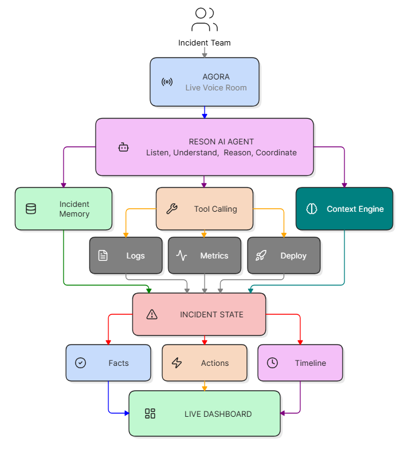
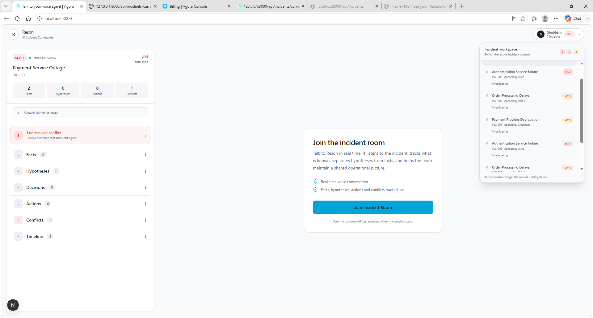
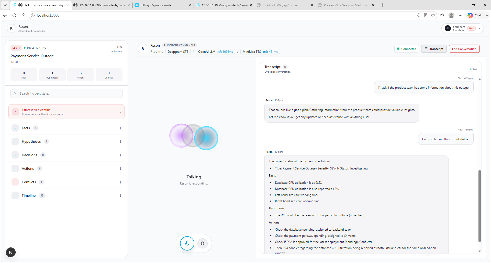
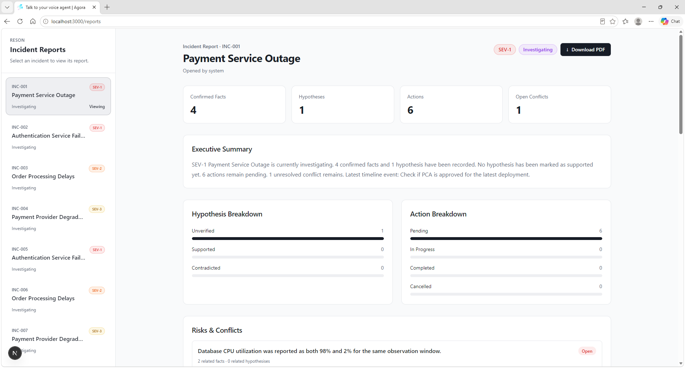

<div align="center">


# Reson

### AI Incident Commander for real-time incident response

**Voice in → structured operational intelligence out.**

[](https://www.agora.io/)
[](https://fastapi.tiangolo.com/)
[](https://nextjs.org/)
[](https://modelcontextprotocol.io/)
[](https://www.python.org/)
[](https://www.typescriptlang.org/)

</div>

Reson is a voice-first AI Incident Commander built to help engineering
teams reason through live technical incidents.

Instead of turning an incident call into a transcript, Reson maintains a
structured operational picture of the incident:

-   **Facts**: confirmed observations
-   **Hypotheses**: possible explanations that still need evidence
-   **Actions**: work that needs to be performed
-   **Decisions**: important decisions made by responders
-   **Conflicts**: contradictory or potentially inconsistent information
-   **Timeline**: meaningful events throughout the incident

The result is a system that turns a live voice conversation into an
evolving incident state and an actionable post-incident report.


------------------------------------------------------------------------

## Why Reson?

During a production incident, responders are simultaneously trying to:

-   listen to multiple people
-   remember what has already been established
-   separate evidence from assumptions
-   track actions and decisions
-   notice contradictions
-   keep the timeline coherent
-   communicate status to stakeholders

Traditional incident tooling is largely passive. Engineers have to
manually update tickets, notes, timelines, and status information while
the incident is unfolding.

**Reson participates in the conversation itself.**

It listens to the live discussion, reasons over the current incident
context, selectively updates structured state, and uses that state to
help the team maintain a coherent operational picture.

## Demo

### 🎥 Reson MVP Demo

> A short walkthrough of Reson as an AI Incident Commander,
> from live incident conversation to structured state and reporting.

**[▶ Watch the full MVP demo](docs/demo.mp4)**

### The demo covers

- 🎙️ Real-time, interruptible voice interaction
- 🧠 Context-aware incident reasoning
- 📋 Structured incident state
- 🔌 MCP-powered incident tools
- ⚠️ Conflict and hypothesis tracking
- 👥 Multi-participant incident room
- 🔄 Multi-incident workflow
- 📊 Incident reporting
- 📄 PDF export

------------------------------------------------------------------------

# What Reson Does

## Project at a glance

``` text
Human responders
      │
      ▼
Real-time voice conversation
      │
      ▼
Reson AI Incident Commander
      │
      ├── Reason over current context
      ├── Decide when to intervene
      └── Use structured MCP tools
                    │
                    ▼
          Incident State
     Facts · Hypotheses · Decisions
     Actions · Conflicts · Timeline
                    │
          ┌─────────┴─────────┐
          ▼                   ▼
     Live Dashboard        Report / PDF
```


### Real-time voice interaction

Reson participates in a live Agora voice session and supports natural,
interruptible conversation.

The voice pipeline combines:

-   **Agora Conversational AI** for real-time agent interaction
-   **Deepgram** for speech-to-text
-   **OpenAI** for reasoning
-   **MiniMax** for text-to-speech

The goal is an incident commander that participates in the response
rather than a voice chatbot waiting for scripted commands.

### Context-aware incident reasoning

Reson does not blindly record every sentence.

It considers whether information is:

1.  materially relevant
2.  new
3.  sufficiently clear
4.  already represented in the incident state
5.  useful to the team's shared understanding

This keeps the operational state useful instead of turning it into
another noisy transcript.

### Structured incident state

Each incident maintains structured state for:

``` text
Incident
├── Facts
├── Hypotheses
├── Decisions
├── Actions
├── Timeline
├── Conflicts
├── Participants
└── Room
```

The incident state is the **source of truth** for operational
information.

### Hypothesis tracking

Responders can discuss possible causes without prematurely treating them
as facts.

Hypotheses can be:

-   unverified
-   supported
-   contradicted

This preserves the distinction between **what we know** and **what we
think**.

### Conflict detection

Reson can identify meaningful contradictions and missing context.

It does not treat every surprising statement as a conflict. When context
is insufficient, it can ask a focused question to determine whether
observations actually refer to the same system, property, or time
window.

### MCP-powered incident tools

Reson uses an MCP server to interact with structured incident state.

Current tool capabilities include:

-   reading incident state
-   recording facts, hypotheses, and actions
-   recording decisions
-   recording conflicts
-   resolving conflicts
-   supporting hypotheses
-   contradicting hypotheses
-   resolving incidents
-   creating incidents
-   listing incidents
-   switching incidents

This keeps the AI reasoning layer separate from the incident-state
implementation.

### Multi-incident support

Reson supports multiple incidents within the same application.

Each incident has its own structured state, and users can switch the
active incident during an investigation.

The reporting workspace can independently select incidents without
changing the active Reson conversation context.

### Incident reporting

The `/reports` workspace turns incident state into a structured report
containing:

-   executive summary
-   KPI cards
-   incident timeline
-   hypothesis breakdown
-   action breakdown
-   conflicts and risks
-   decisions
-   action items

Reports can be exported as PDF.

### Participant-aware architecture

The incident model also supports named participants and room state.

The current implementation provides the foundation for a shared incident
room:

``` text
Incident
   │
   ├── Participants
   │
   └── Room
        └── Stable Agora channel
```

The intended architecture is:

> **One incident → one room → one Reson → many participants**

The shared multi-browser session is the next extension of this
foundation.

------------------------------------------------------------------------

# Architecture



The architecture is centered around a simple principle:

> **Incident State is the source of truth.**

Reson does not maintain a separate authoritative copy of the incident.
When current state matters, the agent reads and updates the structured
incident state through MCP.

This lets the voice layer, API layer, tool layer, and reporting layer
operate around the same underlying incident model.

### High-level flow

``` text
Incident Team
      │
      ▼
   Agora
 Live Voice Room
      │
      ▼
 Reson AI Agent
 Listen · Understand · Reason · Coordinate
      │
      ├──────────────► Incident Memory
      │
      ├──────────────► Context Engine
      │
      └──────────────► Tool Calling
                            │
                       ┌────┼────┐
                       ▼    ▼    ▼
                     Logs Metrics Deploy
                       │    │    │
                       └────┼────┘
                            ▼
                      Incident State
                       │    │    │
                       ▼    ▼    ▼
                     Facts Actions Timeline
                            │
                            ▼
                      Live Dashboard
```

------------------------------------------------------------------------

# Incident State Model

A simplified incident looks like:

``` json
{
  "id": "INC-001",
  "title": "Payment Service Outage",
  "severity": "SEV-1",
  "status": "investigating",
  "participants": [],
  "facts": [],
  "hypotheses": [],
  "decisions": [],
  "actions": [],
  "timeline": [],
  "conflicts": [],
  "room": {
    "channel": "incident-INC-001",
    "agent_id": null
  }
}
```

### Facts

Confirmed information.

``` text
Payment API error rate increased to 42%.
```

### Hypotheses

Possible explanations that have not yet been confirmed.

``` text
Database connection exhaustion may be contributing to the failures.
```

### Actions

Work that needs to happen.

``` text
Inspect database connection pool utilization.
```

### Decisions

Important decisions made by responders.

``` text
Rollback the latest payment-service deployment.
```

### Conflicts

Potentially contradictory observations.

``` text
Application reports database connectivity failures,
while database health checks remain green.
```

------------------------------------------------------------------------

# MCP Layer

Reson uses a **custom MCP server** named `reson-incident-commander`.

The FastAPI backend exposes the MCP server at:

``` text
/mcp
```

The MCP layer provides structured tools for interacting with incident
state.

``` text
Read
├── get_incident_state
└── list_incidents

Write
├── record_incident_event
├── record_incident_decision
└── record_incident_conflict

Reasoning / lifecycle
├── support_incident_hypothesis
├── contradict_incident_hypothesis
├── resolve_incident_conflict
└── resolve_incident

Incident management
├── create_incident
└── switch_incident
```

The agent is instructed to use tools when they improve the operational
picture, not simply because every user utterance could be classified.

### Why MCP?

MCP provides a clean boundary between AI reasoning and application state.
The model reasons about the incident, while explicit tools perform structured
reads and writes against the incident system.

``` text
Live Voice
    ↓
Reson / LLM reasoning
    ↓
MCP tools
    ↓
Structured Incident State
    ↓
Dashboard + Reports
```

This makes the **incident state**, rather than the generated conversation,
the operational source of truth.


------------------------------------------------------------------------

# Application Structure

``` text
reson/
│
├── backend/
│   ├── app/
│   │   ├── incident/
│   │   │   ├── store.py
│   │   │   └── ...
│   │   ├── mcp/
│   │   │   └── server.py
│   │   ├── models/
│   │   │   └── incident.py
│   │   └── api/
│   │       ├── incidents.py
│   │       ├── events.py
│   │       └── rooms.py
│   └── requirements.txt
│
└── frontend/
    ├── app/
    │   ├── api/
    │   │   ├── generate-agora-token/
    │   │   ├── invite-agent/
    │   │   └── ...
    │   └── ...
    ├── components/
    ├── lib/
    └── types/
```

------------------------------------------------------------------------

# Tech Stack

  Layer                        Technology
  ---------------------------- ------------------------------
  Frontend                     Next.js / React / TypeScript
  Backend                      FastAPI / Python
  Voice                        Agora Conversational AI
  RTC / RTM                    Agora
  Speech-to-Text               Deepgram
  LLM                          OpenAI
  Text-to-Speech               MiniMax
  Agent tools                  MCP
  Incident state               In-memory `IncidentStore`
  Validation / models          Pydantic
  Reporting                    Next.js reporting workspace
  PDF export                   Browser-side PDF generation
  Public MCP access for demo   Cloudflare Tunnel

------------------------------------------------------------------------

# Built With

| Area | Technology | Role |
| --- | --- | --- |
| Web app | **Next.js / React / TypeScript** | Incident dashboard and voice UI |
| API | **FastAPI / Python** | Application API and MCP host |
| Voice agent | **Agora Conversational AI** | Real-time conversational agent |
| RTC / RTM | **Agora** | Live incident-room communication |
| Speech-to-text | **Deepgram** | Transcription |
| Reasoning | **OpenAI** | Incident reasoning and tool selection |
| Text-to-speech | **MiniMax** | Agent voice |
| Agent tools | **Model Context Protocol (MCP)** | Structured incident-state access |
| Data model | **Pydantic** | Typed incident state and validation |
| Reporting | **Next.js reporting workspace** | Incident reports and analytics |
| PDF | **Browser-side PDF generation** | Report export |
| Demo networking | **Cloudflare Tunnel** | Public MCP endpoint for the demo |

------------------------------------------------------------------------

# Running Locally

## Prerequisites

You will need:

-   Node.js
-   pnpm
-   Python
-   Agora credentials
-   configured LLM / STT / TTS services
-   FastAPI
-   Next.js
-   `cloudflared` for the public MCP endpoint used by the demo

## 1. Start the backend

``` bash
cd backend
pip install -r requirements.txt
uvicorn app.main:app --reload --port 8000
```

Backend:

``` text
http://localhost:8000
```

Health check:

``` text
GET /health
```

Local MCP endpoint:

``` text
http://localhost:8000/mcp/
```

## 2. Expose the backend with Cloudflare Tunnel

In a second terminal:

``` bash
cloudflared tunnel --url http://localhost:8000
```

Cloudflared will provide a public URL similar to:

``` text
https://xxxx.trycloudflare.com
```

Use the public MCP endpoint as:

``` text
https://xxxx.trycloudflare.com/mcp/
```

Set:

``` env
RESON_MCP_URL=https://xxxx.trycloudflare.com/mcp/
```

Then restart the Next.js development server.

> **Demo note:** the quick tunnel URL changes when the tunnel is
> restarted. If it changes, update `RESON_MCP_URL` and restart the
> frontend.

## 3. Start the frontend

From another terminal:

``` bash
cd frontend
pnpm install
pnpm dev
```

Frontend:

``` text
http://localhost:3000
```

------------------------------------------------------------------------

# Environment Variables

The application expects Agora and Reson configuration such as:

``` env
NEXT_PUBLIC_AGORA_APP_ID=...
NEXT_AGORA_APP_CERTIFICATE=...
RESON_MCP_URL=...
```

Additional provider credentials may be required depending on the
configured LLM, STT, and TTS integrations.

**Never commit credentials or `.env` files to the repository.**

------------------------------------------------------------------------

# API Highlights

## Incidents

``` http
GET /api/incidents
```

List incidents.

``` http
GET /api/incidents/current
```

Get the currently active incident.

``` http
GET /api/incidents/{incident_id}
```

Get a specific incident.

``` http
POST /api/incidents
```

Create an incident.

``` http
POST /api/incidents/switch
```

Switch the active incident.

## Rooms

``` http
POST /api/rooms/join
```

Register a participant in an incident room.

Example:

``` json
{
  "incident_id": "INC-001",
  "name": "Shubham"
}
```

Example response:

``` json
{
  "incident_id": "INC-001",
  "channel": "incident-INC-001",
  "participant": {
    "id": "participant-1",
    "name": "Shubham",
    "role": "participant"
  },
  "agent_started": false
}
```

The room channel is deterministic:

``` text
INC-001 → incident-INC-001
```

This provides the foundation for a shared incident room.

------------------------------------------------------------------------

# Example Incident Conversation

A responder says:

> "Payment failures started about ten minutes ago. The database team
> says the database is healthy, but we're also seeing query timeouts."

Reson can maintain structured state such as:

``` text
FACT
Payment failures started approximately 10 minutes ago.

FACT
Database team reports healthy database status.

FACT
Query timeouts are being observed.

HYPOTHESIS
Database performance degradation may be contributing.

TIMELINE
Payment failures began approximately 10 minutes ago.
```

If later evidence establishes that two observations genuinely conflict,
Reson can represent that conflict instead of silently choosing one side.

------------------------------------------------------------------------

# Screenshots & Sample Report

The repository includes screenshots showing the main Reson workflow and a
sample incident report generated from the structured incident state.

## Application Screenshots

### Reson Home

The main incident workspace showing the active incident, structured state,
and incident room entry point.



### Reson Talking

Live voice interaction with Reson, including the real-time transcript and
structured incident state updating during the conversation.



### Reson Reports

The incident reporting workspace with incident selection and generated
report information.



## Sample Incident Report

A sample PDF report for the Payment Service Outage incident is included
with the project:

**[INC-001 Payment Service Outage Report](docs/reports/INC-001-payment-service-outage-report.pdf)**

The report demonstrates how Reson turns structured incident state into a
post-incident artifact containing the incident summary, timeline,
hypotheses, actions, conflicts, decisions, and other operational context.

Recommended repository layout:

``` text
docs/
├── arch.png
├── screenshots/
│   ├── reson_home.png
│   ├── reson_talking.png
│   └── reson_reports.png
└── reports/
    └── INC-001-payment-service-outage-report.pdf
```

------------------------------------------------------------------------

# Reporting

Navigate to:

``` text
/reports
```

The reporting workspace provides an incident-focused view of the
structured state.

``` text
Executive Summary
        ↓
KPI Cards
        ↓
Timeline
        ↓
Hypotheses
        ↓
Actions
        ↓
Conflicts / Risks
        ↓
Decisions
```

Reports can be selected independently by incident and exported to PDF.

------------------------------------------------------------------------

# Recommended Demo Flow

A strong demo should tell one continuous story rather than showing
disconnected features.

### 1. Start with an active incident

Show:

``` text
Payment Service Outage
SEV-1
Investigating
```

### 2. Start the voice conversation

Introduce Reson as the AI Incident Commander.

### 3. Feed Reson an evolving incident

Discuss:

-   elevated payment failures
-   database latency
-   deployment timing
-   possible root causes
-   actions being considered

### 4. Show the structured state

Demonstrate that Reson has separated:

``` text
Facts
Hypotheses
Actions
Timeline
```

rather than simply producing a transcript.

### 5. Introduce conflicting evidence

Give Reson two observations that require contextual reasoning.

Show how it preserves uncertainty or surfaces the conflict instead of
inventing an explanation.

### 6. Open `/reports`

Show the generated incident summary, timeline, hypotheses, actions, and
risks.

### 7. Export the report

Download the generated PDF.

The complete story:

``` text
Live voice conversation
          ↓
     AI reasoning
          ↓
 Structured incident state
          ↓
 Operational visibility
          ↓
    Incident report
```

------------------------------------------------------------------------

# Design Principles

### Don't transcribe. Understand.

Reson is not intended to create a database entry for every sentence.

### Don't guess. Preserve uncertainty.

A hypothesis should remain a hypothesis until evidence supports it.

### Don't hide contradictions.

Conflicting evidence is operationally valuable information.

### Don't make the AI the database.

The incident state belongs to the application. Reson reasons over it
through MCP.

### Keep humans in the loop.

Critical operational actions can require human confirmation.

------------------------------------------------------------------------

# Security & Operational Boundaries

Reson is a hackathon/MVP prototype and should not be connected to production
systems without additional controls.

Important boundaries:

- Keep provider credentials and tokens out of source control.
- Do not commit `.env` files or secrets.
- Critical or destructive operational actions should remain human-approved.
- The current incident store is in-memory and is not a durable production database.
- The multi-participant room implementation is a foundation for shared sessions,
  not a production-grade conferencing/identity system.
- Add authentication, authorization, audit logging, persistence, and
  observability before using Reson for real incidents.

------------------------------------------------------------------------

# Open Source

Reson is intended to be developed as an open-source project.

## Contributing

Contributions, experiments, bug fixes, and ideas are welcome.

A good contribution flow is:

1. Fork the repository.
2. Create a focused branch.
3. Make the change and add/update tests where appropriate.
4. Run the frontend and backend checks locally.
5. Open a pull request describing the problem and the change.

For larger architectural changes, open an issue first so the approach can be
discussed before implementation.

## Development Guidelines

- Keep incident state explicit and structured.
- Prefer evidence over speculation.
- Keep critical operational actions human-controlled.
- Avoid coupling the UI directly to provider-specific agent behavior.
- Keep MCP tools small, explicit, and auditable.
- Do not add state to the transcript when it belongs in the incident model.


------------------------------------------------------------------------

# Current Status

### Completed

-   [x] Real-time voice incident interaction
-   [x] Interruptible conversational AI
-   [x] Structured incident state
-   [x] Facts / hypotheses / actions
-   [x] Decisions
-   [x] Conflict tracking and resolution
-   [x] Hypothesis support / contradiction
-   [x] Incident lifecycle
-   [x] MCP incident tools
-   [x] Multi-incident architecture
-   [x] Silent incident switching
-   [x] Multi-incident reporting
-   [x] Executive summary
-   [x] Timeline and breakdown views
-   [x] PDF report export
-   [x] Participant model
-   [x] Incident room foundation
-   [x] `/api/rooms/join`

### Next extension

The participant and room model provides the foundation for:

-   participant presence and role-aware interaction
-   multi speaker detection in rooms
-   authentication and role-based access control
-   production observability integrations for logs, metrics, and deployments
-   robust multi-user Agora room coordination
-   participant presence and speaker attribution
-   one-agent-per-room lifecycle guarantees
-   audit logs for state changes and tool calls
-   richer remediation workflows with approval gates
-   intelligent MCP tools that make interactions more specific

------------------------------------------------------------------------

# Project Vision

Incident response should not require engineers to simultaneously be:

-   investigators
-   note takers
-   meeting facilitators
-   timeline maintainers
-   status communicators

Reson is designed to become the operational layer between the
conversation and the incident record.

The long-term goal is simple:

> **When an incident gets chaotic, Reson keeps the team's understanding
> coherent.**

